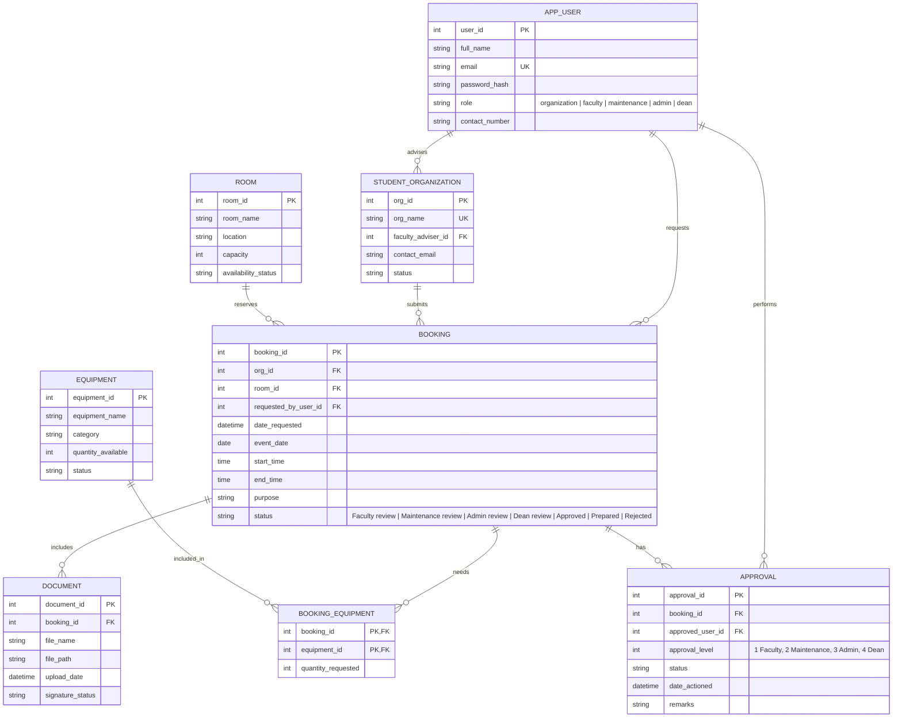

# Cardinal Resource Hub

Cardinal Resource Hub is a Mapúa University facility and equipment reservation system for organizations, faculty reviewers, maintenance staff, administrators, and the Dean.

## Repository Layout

```text
src/                 Active React application and shared styles
public/              Runtime assets, including the Mapúa logo
database/            Neon/PostgreSQL schema reference
reference/           Original project references and source materials
README.md            Product, workflow, and database documentation
vite.config.ts       Vite development and production configuration
```

## Approval Flow

`Organization submission → Faculty review → Maintenance handling → Admin review → Dean final decision → Approved`

The Dean is the final authority for budget, policy, and campus-rule decisions. Admin manages the resources and performs the operational review immediately before the Dean's decision.

## ERD Database Design

The following relational design is intended for Neon PostgreSQL. The executable reference schema is in [database/schema.sql](database/schema.sql).



### Role Responsibilities

| Role | Responsibility | Database authority |
| --- | --- | --- |
| Organization | Owns its account, submits event requests, and tracks bookings | Creates `BOOKING`, `DOCUMENT`, and `BOOKING_EQUIPMENT` records |
| Faculty | Reviews the organization submission and adviser documents | Creates level 1 `APPROVAL` records |
| Maintenance | Checks equipment and setup after faculty approval | Creates level 2 `APPROVAL` records and updates readiness |
| Admin | Manages rooms, equipment, organizations, and operational review | Creates level 3 `APPROVAL` records |
| Dean | Makes the final decision on budget, policy, and campus rules | Creates level 4 `APPROVAL` records and moves the booking to `Approved` or `Rejected` |